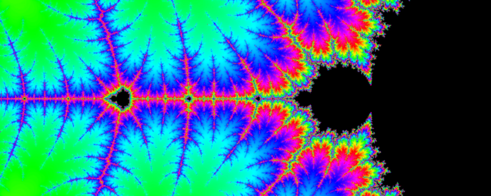

# Rekursion, minne och abstrakta datatyper

## Innehåll
- [Kodexempel](#kodexempel)
- [Föreläsningsslides](#presentationer)
- [Andra filer](#andra-filer)
- [Resurser](#resurser)

# Kodexempel

Sourcemappen innehåller:

| Filnamn                         | Beskrivning                                                                                                                                     |
|----------------------------------|-------------------------------------------------------------------------------------------------------------------------------------------------|
| **Ackermann.java**               | Exempel på Ackermannfunktionen, den första ickeprimitiva rekursiva funktionen som upptäcktes (löjligt beräkningstung!)                          |
| **BinarySearch.java**            | Exempel på hur en binär sökning fungerar i Java.                                                                                                |
| **IterativeFibonacci.java**      | Ett exempel på hur iteration kan användas för att få bort den exponentiella tidskomplexiteten som en rekursiv fibonacci innebär.              |
| **RecursiveFibonacci.java**      | En rekursiv fibonaccialgoritm som anropar sig själv två gånger varje gång den körs.                                                              |
| **RecursiveFibonacciDynamic.java**| Ett rekursivt fibonaccialternativ som använder en dynamisk programmeringsteknik för att effektivisera algoritmen.                                 |
| **RecursiveFibonacciStackCounter.java** | Ett program som genererar en webbsida som visar vad som pushas på och poppas från callstacken när en rekursiv fibonaccialgoritm anropas. |
| **Stack.java**                   | En implementation av en stack som använder Generics för att man ska kunna lagra olika typer av data i den.                                      |
| **ValueVsReference.java**       | Ett kort exempel som illustrerar skillnaden mellan att skicka variabler som värde och att skicka dem som referenser i Java.                    |

# Föreläsningsslides
| Filnamn                         | Beskrivning                                                                                                                                     |
|----------------------------------|-------------------------------------------------------------------------------------------------------------------------------------------------|
|[**Föreläsning_1_Algo.pdf**](Föreläsning_1_Algo.pdf)| Presentationen från föreläsningstillfälle 1 och 2 (29/1) där vi behandlade rekursiva algoritmer, callstacken, minne, referenser och dynamisk programmering. |
|[**Föreläsning_2_Algo.pdf**](Föreläsning_2_Algo.pdf)| Presentationen från föreläsningstillfälle 3 och 4 (30/1) där vi pratade om träd, grafer, abstrakta datatyper, Generics och garbage collection. |

# Andra filer
| Filnamn                         | Beskrivning                                                                                                                                     |
|----------------------------------|-------------------------------------------------------------------------------------------------------------------------------------------------|
|[**Rekursivt_fibonacciträd.pdf**](Rekursivt_fibonacciträd.pdf) | En bättre översikt av anropsträdet som skapas när vi anropar en rekursiv fibonaccialgoritm. Visar även hur anropen returnerar värden.            |
|[**Uppgifter.pdf**](Uppgifter.pdf) | Uppgifter att arbeta med som handlar om det vi gått genom under föreläsningarna. |
|[**Uppgifter_lösningsförslag.pdf**](Uppgifter_lösningsförslag)| Lösningsförslag till uppgifterna ovan. (Försök att lösa dem själva innan ni kikar på lösningarna!) |

# Resurser
- **Kort film om MC Escher** (4 min) 

- **Fördjupning: Ackermannfunktionen** (14 min) 

-

